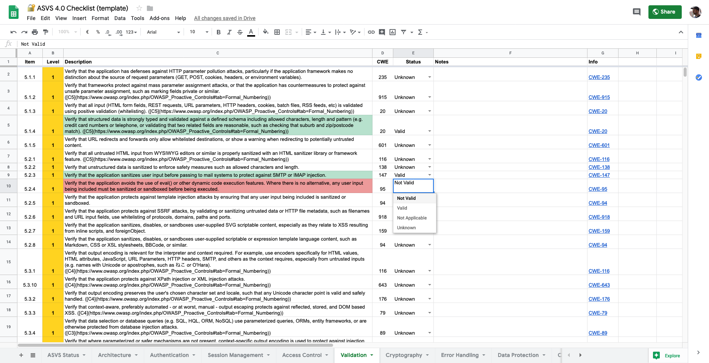

🔐 OWASP ASVS 4.0 Checklist
===========================

Checklist for [OWASP's ASVS v4.0](https://www.owasp.org/index.php/Category:OWASP_Application_Security_Verification_Standard_Project)

It's probably easiest if you copy [this Google Docs file](https://docs.google.com/spreadsheets/d/19RBElPz3bnYQprlc3RidueYd81bY7kRiTHRopgtWOTE
) to your own drive and work from there.

Alternatively, you may download one of these files:
 - [ASVS_v4.0_Checklist.ods](ASVS_v4.0_Checklist.ods)
 - [ASVS_v4.0_Checklist.xlsx](ASVS_v4.0_Checklist.xlsx)



Usage
=====

If you need to re-parse the CSV into individual files for easier usage, run this:

```shell
$ ./parse_csv resources/OWASP_Application_Security_Verification_Standard_4.0-en.csv
```
